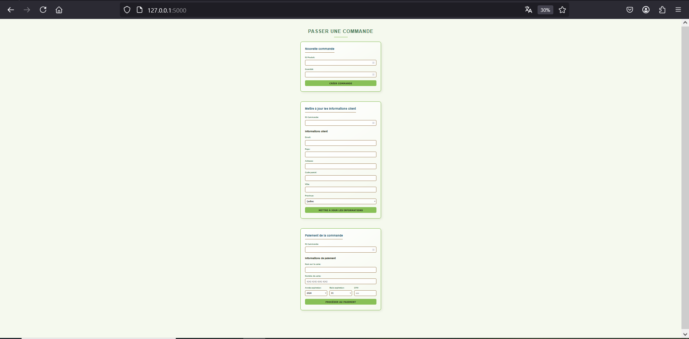
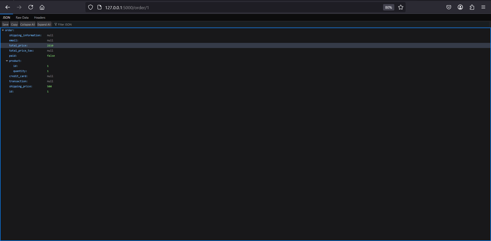
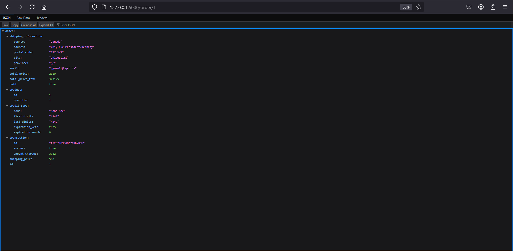

# Projet INF349

Fait avec Konogan Godefroy et Alex Thiebot

## Table des matières
- [Introduction](#introduction)
- [Site web](#site-web)
- [Construit avec](#construit-avec)
- [Installation](#installation)
- [Configuration](#configuration)
- [Exécution des tests](#exécution-des-tests)


## Introduction
Ce projet a pour objectif de développer une application web de gestion des commandes et des paiements en ligne en utilisant Python (Flask). L’application repose sur une API REST permettant d’afficher les produits disponibles, de créer et gérer des commandes, ainsi que de traiter les paiements via un service externe.

L’accent est mis sur la performance, la résilience et la fiabilité du système, en respectant les bonnes pratiques du développement web. Le projet se déroule en deux phases :

Première remise : Développement de l’API REST pour gérer les commandes et récupérer les produits.
Remise finale : Ajout des fonctionnalités de paiement, gestion des transactions et intégration des taxes et frais d’expédition.

L’application utilise une base de données SQLite avec l’ORM Peewee et doit être déployée en respectant les exigences techniques imposées. Une attention particulière est portée à la qualité du code, aux tests unitaires et à la sécurité des transactions.

## Site web

1. Page d'accueil : http://localhost:5000

2. Liste des produits JSON : http://localhost:5000/products

3. Commande initialisée JSON : http://localhost:5000/order/1

5. Paiement finalisé JSON : http://localhost:5000/order/1 
  

## Construit avec
- **Backend** : ![Python] + ![Flask]
- **ORM** : ![Peewee]
- **Base de données** : ![SQLite]
- **Tests** : ![Pytest]
- **Services externes** :
  - 📦 API Produits : `http://dimensweb.uqac.ca/~jgnault/shops/products/`
  - 💸 API Paiement : `http://dimensweb.uqac.ca/~ignault/shops/pay/`


## Installation

Pour installer les dépendances nécessaires, utilisez la commande suivante :

```bash
pip install peewee flask pytest pytest-flask
```

## Configuration
1. Accéder au répertoire du projet

```bash
cd chemin/vers/votre/projet
```

2. Paramètres pour Windows

Définissez les variables d'environnement :

```powershell
$env:FLASK_APP = "app.py"
$env:FLASK_DEBUG = "1"
```

3. Initialisation de la base de données

```bash
python -m flask init-db
```

4. Lancement de l'application
```bash
python -m flask run
```

L'application sera accessible à l'adresse : http://localhost:5000

## Exécution des tests

Pour vérifier le bon fonctionnement du projet, lancez les tests avec :

```bash
cd chemin/vers/votre/projet
python -m pytest -v tests/v
```


[Peewee]: https://img.shields.io/badge/Peewee-FF9900?logo=bitcoin&logoColor=white
[SQLite]: https://img.shields.io/badge/SQLite-25A768?logo=sqlite&logoColor=white
[Python]: https://img.shields.io/badge/Python-3776AB?logo=python&logoColor=fff
[Flask]: https://img.shields.io/badge/Flask-fff?logo=flask&logoColor=000
[Pytest]: https://img.shields.io/badge/Pytest-222?logo=pytest
